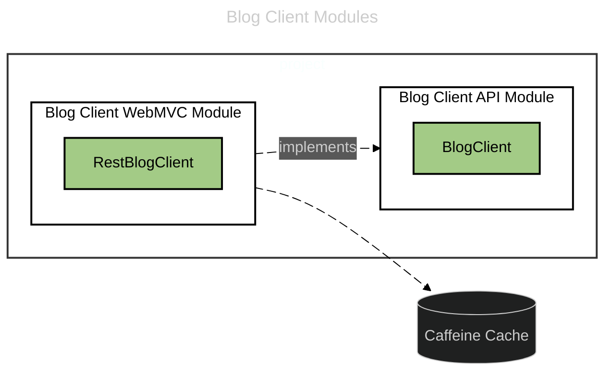

# 외부에 제공하는 기능들

## 블로그 관리용 내부 API 클라이언트 모듈

**Blog 내부 API 클라이언트 모듈**은 <ins>내부 서버 간 통신</ins>을 단순화합니다.  

- 클라이언트 서버에서 블로그 관리 기능을 손쉽게 호출하도록 지원합니다.
- 동일 입력 동일 출력을 보장하는 일부 기능에 단시간 **<ins>캐싱</ins>을** 지원합니다.

### 모듈 구성

다음과 같은 모듈 관계를 갖습니다.

- **blog-client-api**
  - `BlogClient` 인터페이스 제공 (Port)
- **blog-client-webmvc**
  - `RestBlogClient` 구현체 (Adapter)
  - Bean 등록 (베이스패키지를 스캔해야 빈으로 등록되도록 함.)  

---

### 캐싱 정책

- **지원 방식**
  - **의존성**: Caffeine 기반의 캐싱 지원
  - **캐시 대상**: 동일 입력 → 동일 출력을 보장하는 요청 유형에 대해 단기 캐싱
  - **캐시 수명**: **10분** (MVP 기준, 수명 설정 옵션 없음)

- **메서드 유형**
  - **캐시 지원 메서드**: 캐시에서 조회 → 없으면 API 요청 후 캐시 저장
  - **캐시 우회 메서드**: 캐시를 무시하고 API 요청 (응답은 캐시에 저장)

---

### 지원 기능

- 회원 PK 기반 블로그 소유권 확인
  - `verifyOwnership(userId, blogId)`
  - `verifyOwnershipFresh(userId, blogId)` (캐시 무시)
- 프로필 PK 기반 블로그 소유권 확인
  - `verifyOwnershipByProfileId(profileId, blogId)`
  - `verifyOwnershipByProfileIdFresh(profileId, blogId)` (캐시 무시)

**제한 사항**

- 블로그 삭제 후에도 최대 10분간 캐시된 결과 반환 가능
- 블로그 삭제 이벤트 기반 캐시 무효화 로직은 미구현 (MVP 이후 고려)

---

### 향후 계획

- 블로그 생명주기 관리 API 클라이언트 메서드 추가 예정
  - 회원 생성/삭제 시 블로그 동기 관리 (auth 서버와 연계)
  - 초기 MVP 범위에서는 클라이언트 서버별 상세 권한 분리 미적용  
